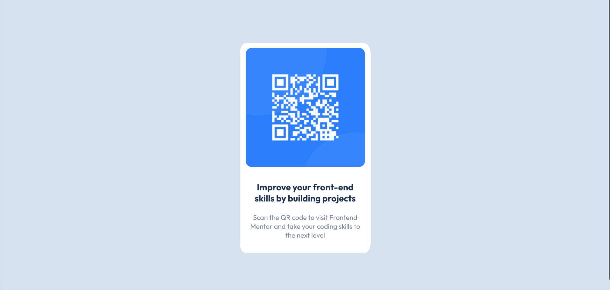

# Frontend Mentor - QR code component solution

This is a solution to the [QR code component challenge on Frontend Mentor](https://www.frontendmentor.io/challenges/qr-code-component-iux_sIO_H). Frontend Mentor challenges help you improve your coding skills by building realistic projects. 

## Table of contents

- [Overview](#overview)
  - [Screenshot](#screenshot)
  - [Links](#links)
- [My process](#my-process)
  - [Built with](#built-with)
  - [What I learned](#what-i-learned)
  - [Continued development](#continued-development)

## Overview

### Screenshot

### Links

- Solution URL: [Add solution URL here](https://github.com/jrotstejn/qr_code_component)
- Live Site URL: [Add live site URL here](https://jrotstejn.github.io/qr_code_component/)

## My process
- Analyzed how to structure everything, started working in VS Code according to my structured draft.

### Built with

- Flexbox

### What I learned

I need to build more project to get more affinity with the basics of web development. 

### Continued development

Build more on a daily basis. 

se could come in handy for anyone viewing your solution or for yourself when you look back on this project in the future.**

